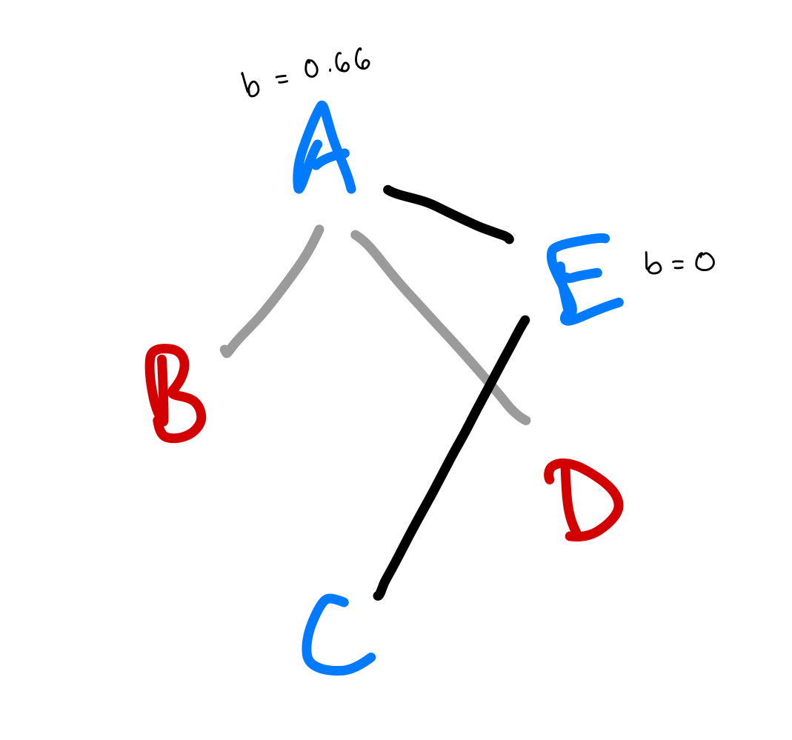

```{r setup, include=FALSE}
knitr::opts_chunk$set(echo = FALSE)
```

```{r include = FALSE}
library(tidyverse)
library(gifski)
library(ggraph)
library(here)
library(igraph)
library(tnet) # for the closeness function described here: https://toreopsahl.com/2010/03/20/closeness-centrality-in-networks-with-disconnected-components/
source(here("modelFunction_rewiring.R"))

# Define parameters
N = 50
mnSocExp = 0.3
n.removed = 10
baseline.in = 10
baseline.out = 5
mod00 = -0.4
mod01 = 0.2
mod10 = -0.2
mod11 = 0.4
coefBereavement = 1

# One model run
mod1 <- runModel(N = N, n.removed = n.removed, mnSocExp = mnSocExp, baseline.in = baseline.in, baseline.out = baseline.out, mod00 = mod00, mod10 = mod10, mod01 = mod01, mod11 = mod11, id = NULL, coefBereavement = coefBereavement)
socs <- mod1$socs
graphs <- mod1$graphs
```

# Introduction

## Vultures and mortality by poisoning

Eurasian griffon vultures (*Gyps fulvus,* hereafter "griffons" or "griffon vultures") are obligate scavengers [@ruxton2004] and social foragers [@harel2017]. This means that they feed exclusively on carcasses. They locate these food sources largely by following other individuals---using social information to locate food is essential in an environment where food sources are both ephemeral and spatio-temporally unpredictable.

However, vultures' tendency to aggregate at carcasses makes them particularly vulnerable to poisoning at carcasses laced with pesticides, which are often illegally deposited by farmers to target predators that threaten their livestock [@bbcnews2019]. Another source of poisoning is non-steroidal anti-inflammatory drugs (NSAIDs), which are often used for veterinary treatment of livestock and can be toxic to vultures [@anglister2022]. Poisoning is a major threat to griffon vulture populations. It is the leading cause of death in the griffon population in Israel, where the species is locally endangered [@anglister2022]. It also threatens vulture species across the world [@ives2022a]. Crucially, because vultures gather to feed at carcasses, poisoned carcasses can kill many individuals within a very short time period. For example, on 2021-10-24 in the southern part of Israel, 13 vultures died in a single poisoning event [@anglister2022a]. In 2019, eight vultures were poisoned in one day in the Golan Heights, in northern Israel, with two more transported to a wildlife hospital for treatment after they were found alive at the carcass site [@bbcnews2019a].

{alt="A Eurasian Griffon Vulture (Gyps fulvus) and an Egyptian Vulture (Neophron percnopterus) feed at a carcass provided at a feeding site in Israel. Photo by Noa Pinter-Wollman."}

## Effects of mortality on social structure

Mortality events such as those caused by poisoning affect not just the raw number of individuals in a population but also the population's social structure---the frequency and patterns of relationships between particular individuals. Social structure affects <!--# thing, ref --> and <!--# thing, ref -->, which are both of conservation concern. Therefore, it is important to understand how mortality might impact these processes.

One way of understanding population social structure is by modeling it as a social network. Node removal has been a topic of interest in the social network literature for some time, with a particular focus on understanding how the characteristics of the removed node mediate the effect of its removal on the network. This literature has also explored how networks react to sequential removals of multiple nodes; for instance, <!--# REF --> finds that <!--# result having to do with network collapse after a certain point -->. However, the existing literature has not explored the results of the simultaneous loss of several individuals (as opposed to the loss of one individual or sequential loss of several).

### Global network measures

Here, I use a modeling approach to simulate a vulture population in which several individuals are lost simultaneously. I examine the effect of the removals, and the subsequent rewiring of the network, on several global measures of social network structure.

Network **density** describes the number of edges present in the network, divided by the total number of possible edges. <!--# explanation of why density matters -->.

**Mean distance** describes the average minimum distance between each pair of nodes in the network, following existing edges. <!--# explanation of why mean distance matters -->.

Finally, **modularity** measures whether a given division of the network into clusters is good, i.e. the extent to which there are more within-cluster edges than between-cluster edges (see [Methods] for more details on clustering algorithms <!--# TODO add more details -->) [@clauset2004]. Networks with intermediate levels of modularity transmit social information most efficiently [@romano2018], and <!--# another citation here about why modularity is relevant/important -->

### Characterizing the lost nodes

The effect of multiple-node loss on these network measures should depend not only on **how many** nodes are lost, but also on **the characteristics** of those nodes, relative both to the network at large and to each other. Understanding how the characteristics of the removed nodes affects the consequences of the removal will help us predict the consequences of real-world removals. We might measure the characteristics of the removed nodes either individually or in aggregate, and each of these levels might be important to understanding the effect of the removal on the network structure.

First, we might ask how central the removed nodes were. We know that removing a single more central individual has a greater effect on the network <!--# REF -->. By extension, I predict that when the multiple removed nodes are more central on average, there will be a greater effect on network structure as a result of their removal. This type of measure will be important if, for example, more central individuals tend to arrive at a poisoned carcass first (e.g. because they have more access to social information about food resources) and/or get better access to the carcass (and therefore a higher dose of the poison) than less central individuals.

Second, we can ask to what extent the removed nodes are clustered on the network, as opposed to evenly spread across it. This is a relevant question if, for example, social transmission of information about the carcass location results in poisoned individuals being more closely clustered on the network than would be expected by chance.

**Question 1:** How is the effect of multiple-node loss on global network measures mediated by the centrality and clusteredness of the removed nodes?

### Recovery and rewiring of the network following losses

Rewiring is the process of individuals establishing new social connections (or, in a weighted network, strengthening existing ones) following node loss. [@farine2021] describes a pattern of "second-degree rewiring" in a network of songbirds following flockmate loss, whereby individuals with ties to the lost individual are more likely to form new connections with each other than with other individuals.

Since I am interested in determining how the simultaneous loss of multiple individuals affects the structure of the griffon vulture social network, I wanted to be able to test hypotheses about how rewiring proceeds in this system. In other words, how does having been connected to removed individuals affect an individual's tendency to make new connections or retain existing ones? Does second-degree rewiring operate in the griffon vulture system, or do we observe a different pattern?

<!--# Probably another introductory paragraph here -->

In behavioral ecology, [@shizuka2020] has distinguished between different types of mortality or node removals, arguing that the response of the social network should be different in cases where mortality can be reasonably anticipated by individuals in the population (such as mortality due to sickness or old age) than in cases of unanticipated mortality (e.g. predation or anthropogenic causes like shooting or poisoning).

**Question 2:** How do the effects of multiple-node loss differ under different assumptions about how individuals are affected by the deaths of their connections (i.e. rewiring rules)?

# Methods

## Study System: A Vulture Co-Feeding Network

The system that inspired this model is a GPS-tagged population of griffon vultures in Israel. The species is locally critically endangered [@efrat2020a] and is managed by the Israel Nature and Parks Authority (INPA), which runs supplemental feeding stations throughout the country [@spiegel2013]. Israel's griffon vultures live mainly in the Negev and Judean deserts in the south. There is a small population in northeastern Israel and a declining population in the northwest.

As part of a collaborative NSF-BSF project between Orr Spiegel and Noa Pinter-Wollman, nearly 100 vultures have been fitted with GPS transmitters over the past two years. These tags provide location information at 10-minute intervals, with data automatically transmitted to Movebank. As of 2022, approximately 70% of the griffon population in Israel is tagged. This high coverage of the population means that the majority of a tagged individual's social interactions are with other tagged individuals, allowing us to study social interactions with greater certainty than is possible in many studies of free-ranging animals.

Despite the extent of this dataset, it is not sufficient to directly address questions about the impact of multiple mortality on the vulture social network. While poisoning events pose a severe threat to the vulture population, mass poisonings have occurred only a handful of times during the current study, and in several instances they occurred in regions where relatively smaller proportions of the population were tagged. Therefore, I wanted to create a model that would mimic the baseline dynamics of the real vulture social network, and which I could perturb to test hypotheses about the effect of multiple mortality on the griffon vulture social network.

## Model structure and parameterization

I set out to create an individual-based model that would plausibly capture the day-to-day dynamics of the griffon vulture social network. In the past, the NSF-BSF vulture team has created interaction networks specific to different social situations, defining the network edges in different, biologically meaningful ways for each situation [@sharma2022]. For example, an interaction in the "co-feeding" network is defined as two individuals coming within 50 meters of each other during at least two consecutive 10-minute intervals. My model is intended to represent a co-feeding network in an abstract way.

### Baseline

The initial network consists of `N` nodes, each of which is assigned an inherent interaction probability, which I will refer to as `sociability`. `sociability` values are drawn from a beta distribution (so that its domain is restricted to [0,1]) with parameters `socAlpha` and `socBeta`. <!--# defaults, and parameterizing this--maybe based on the degree distribution that it generates? --> Multiplying all combinations of individual `sociability` values generates an undirected probability matrix, which is then used to perform a series of weighted coin flips to select whether an edge does or does not exist between the two individuals in question. Two adjacency matrices are generated in this way for the first two time steps of the model.

Subsequent time steps take into account the presence or absence of edges in the previous two time steps. For each edge, the baseline edge probability (`sociabilityA` \* `sociabilityB`) is modified by one of four modifier coefficients (`mod00`, `mod01`, `mod10`, and `mod11`) according to its history. For example, an edge with history "00" (i.e. the edge did not exist in either of the previous two time steps) will have the new probability p~A,B~ = `sociabilityA` \* `sociabilityB` \*(1+`mod00`). (By analogy, `mod01` is used for edges that existed in the most recent time step but not in the one before, `mod10` for edges that did not exist in the most recent time step but *did* exist in the one before, and `mod11` for edges that have existed in both previous time steps.) By default, the modifier values are set as follows:

`mod00` = -0.2 (i.e. an edge with history "00" is 20% *less* likely to exist in the next time step than would be predicted by the baseline sociability values of its two nodes)

`mod10` = -0.1

`mod01` = 0.1

`mod11` = 0.2 (i.e. an edge with history "11" is 20% *more* likely to exist in the next time step than would be predicted by the baseline sociability values of its two nodes)

These values are intended to introduce social preference into the model. Previous associations are more likely to persist into the next time step, but once an edge has been lost, it is likelier to stay lost. <!--# consider heavily penalizing mod00 and making mod10 slightly positive... -->

In some cases, these adjustments will produce probability values greater than 1 or less than 0. After computing the probabilities, they are truncated, with any values \> 1 set to 1 and any values \< 0 set to 0.

This process is repeated in each time step for the length of the `baseline.in` period, producing steady-state dynamics, with individuals' degrees being relatively stable over time. The network in the time slice following the `baseline.in`th network is the one from which nodes will be removed (see [Removal]).

```{r echo = FALSE, out.width = "20%"}
# an example of some baseline dynamics
ex <- runModel(N = 30, n.removed = 3, mnSocExp = mnSocExp, baseline.in = baseline.in, baseline.out = baseline.out, mod00 = mod00, mod10 = mod10, mod01 = mod01, mod11 = mod11, id = NULL, coefBereavement = coefBereavement)
soc <- ex$socs
example <- ex$graphs[3:baseline.in][1:5]
example <- lapply(example, function(x){
  x <- igraph::set_vertex_attr(x, name = "Sociability", value = soc)
})
for(i in 1:length(example)){
  tidy <- tidygraph::as_tbl_graph(example[[i]])
  g <- ggraph(example[[i]], layout = "fr")+
    geom_edge_link()+
    geom_node_point(size = 10, aes(col = Sociability))+
    theme_void()+
    scale_color_viridis_c()+
    theme(legend.position = "none")+
    NULL
  print(g)
}
```

### Removal

In the removal phase, `n.removed` nodes are removed from the network, along with all of their edges. This simulates a multiple mortality event (e.g. a poisoning). By default, the removed nodes are chosen randomly, though the model contains an `id` parameter that can be used to optionally specify the identities of `n.removed` particular nodes. Thus, the network at time step `baseline.in + 1` contains `N - n.removed` individuals, as will the networks at all subsequent time steps.

### Rewiring

For each individual remaining in the network after the removal time step, a `bereavement` proportion is calculated as the (number of its associates in the time step immediately before removal that were subsequently removed)/(degree in the time step immediately before removal). In other words, what proportion of the individuals it was connected to died in the mortality event? This is a coarse measure of how directly affected the focal individual is by the multiple mortality event.

For example, if individual A had interacted with B, D, and E, and individuals B and D subsequently died in the mortality event, then individual A would have a value of 2/3 = 0.66 for its `bereavement`. Meanwhile, individual E, which had interacted only with A and C, would not be affected at all (`bereavement` = 0).

{width="316"}

The degree to which an individual's `bereavement` proportion affects its interaction probability is controlled by `coefBereavement`. By default, `coefBereavement` is 1, which means that for every percentage point that `bereavement` increases, an individual's `sociability` increases by that same amount. Using the example shown above, if individual A had a `sociability` value of 0.5 and individual E had a `sociability` value of 0.3, their new sociability values would be as follows:

`sociabilitynew` = `sociabilityold` \* (1+(`bereavement` \* `coefBereavement))`

`sociabilityAnew` = 0.5\*(1+0.66\*1) = 0.83

`sociabilityEnew` = 0.3\*(1+0\*1) = 0.3

Next, a new probability matrix is computed using these modified sociability values.

Finally, the modified probability matrix is adjusted using the `mod` values, according to the same process described above, and the probabilities are truncated to ensure that they fall between 0 and 1. The final probability matrix is used, once again, for a series of weighted coin flips that assign edges to exist or not in the first time step following removal.

Finally, the model is allowed to return to its baseline dynamics for a number of time steps specified as `baseline.out`.

# Results

# Discussion and future directions
