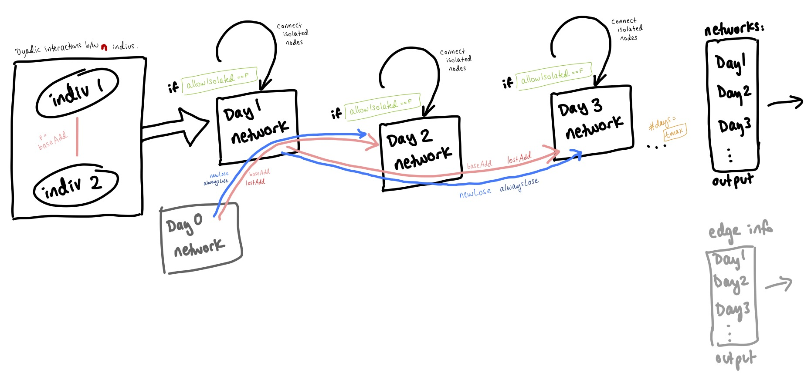

```{r setup, include=FALSE}
knitr::opts_chunk$set(echo = TRUE)
```

## 1. Statement of problem you're studying. In one clear sentence, what question do you hope to answer?

How long does it take for a social network to recover its former characteristics following the loss of several closely-connected nodes?

## 2. Brief description of your model. Describe and justify your decisions with respect to choice of state variables, discrete or continuous time, deterministic or stochastic, spatial (or other) structure, etc.

After a lot of discussion with Ana and Jamie, we decided that my initial approach (beginning with a static network, making one change, and rewiring in a specific way) was too deterministic to really be informative about the dynamics of the system. Jamie and I determined that it would be useful for me to start working on an individual-based model, gradually building up complexity. Even though the model is very simple right now, I hope it will be a useful foundation for my dissertation work going forward. Working on this model has already been extremely instructive, since it's given me a chance to get hands-on experience working with networks in R.

My model is individual-based, but not spatially explicit. It has memory going back two time steps. I begin by initializing a starting network, with initial edges drawn randomly according to the probability `baseAdd` of a new edge forming between previously-unconnected nodes. Then, in each time step, I randomize the fate of each edge. Because the model keeps track of the previous two time steps, each edge is assigned either `never` (edge not present in either of the previous two steps), `always` (edge present in both of the previous two steps), `lost` (not present in the previous step, but present in the one before that), or `new` (present in the previous step, but not in the one before). For each of these states, there is a parameter that determines the probability of losing or gaining an edge (vs. maintaining the current state of edge presence/absence).

The output of the model is a list of graphs, one for each time step. I have also defined some utility functions that make it easy to plot the graphs and to calculate node-level metrics like degree and centrality for each time step. These functions provide a scaffolding that I can expand to do other calculations en masse. Finally, the model also (optionally) outputs a detailed accounting of the status and fate of each edge in each time step.

## 3. Diagram and model equations for your base model, and for any extensions you are actively working on. (No need to list all the ideas that you probably won’t have time to pursue in the next few weeks.)

```{r echo = F}

```
I really struggled with representing this in a diagram, so I hope this makes sense! The box on the left is meant to convey that the assignment of an edge between individuals occurs for each dyad, not just for two of the `n` individuals (nodes). All of these edges together make up the Day 1 network. If isolated nodes are not allowed, each isolated node in the Day 1 network is connected randomly to one other node. We initialize a dummy "Day 0 network" with no edges to allow for memory going back two steps for the Day 2 network. The pink arrow represents gain of edges, which can happen with probability `baseAdd` or `lostAdd` depending on the history of the edge in question. The blue arrow represents loss of edges, which can happen with probability `newLose` or `alwaysLose` depending of the history of the edge in question. For each subsequent day, isolated nodes are connected according to the same procedure as in Day 1. This is repeated for `tmax` days. Graphs and edge info for each day's network are stored and returned by the function.

## 4. R code for your base model. This doesn't have to include all the bells and whistles, but we want to see that you have the core model working. (It can be sent in a separate file, or you can do it all in markdown if you want.)

### Load packages
```{r include = FALSE, echo = FALSE}
library(tidyverse)
library(igraph)
library(ggraph)
library(tidygraph)
library(data.table)
```

### Define utility functions for later use
```{r}
# FOR USE IN THE MODEL:
# Function that searches for any nodes that are not connected at 
# all to other nodes, and attaches them to one other node at random.
connectIsolatedNodes <- function(g, allow){
  if(any(degree(g) == 0) & allow == FALSE){
    isolatedNodes <- which(degree(g) == 0)
    gOut <- g
    for(focalNode in isolatedNodes){
      gOut <- add_edges(gOut, 
                        edges = c(focalNode, #from the focal node...
                                  #...to any other node
                                  # (but not self!)
                                  sample((1:length(V(gOut)))[-focalNode], 
                                         size = 1)))
    }
    return(gOut)
  }else{
    return(g) # pass the graph through as it is, if there are no isolated nodes
  }
}

# Get only unique edges (since we're dealing with an undirected graph)
uniqueEdges <- function(n){
  df <- expand.grid(from = 1:n, to = 1:n) %>%
    mutate(inOrder = case_when(from == to ~ NA_character_, 
                               from > to ~ paste(to, from),
                               from < to ~ paste(from, to))) %>%
    filter(!is.na(inOrder)) %>% # remove self edges
    group_by(inOrder) %>%
    slice(1) %>% # take only one edge for each
    ungroup() %>%
    select(-inOrder)
  return(df)
}

# FOR USE IN ANALYZING THE RESULTS:
# Make a bunch of plots to show change in the network over the model run
plotSim <- function(modelOutput, pointsize = 5, edgewidth = 0.2){
  # Create coords for plotting based on the first day's network
  coords <- layout_with_fr(modelOutput[[1]])
  
  return(lapply(modelOutput, function(x){
    x %>%
      ggraph(layout = coords)+
      geom_edge_link(edge_width = edgewidth)+
      geom_node_point(size = pointsize)
  }))
}

# Get node-level stats for the model simulation output
getNodeStats <- function(modelOutput, type = "df"){
  # Check to make sure the "type" argument is valid
  if(!(type %in% c("df", "graphs", "list"))){
    stop("Argument 'type' must be 'df', 'graphs', or 'list'.")
  }
  
  # Calculate stats
  stats <- lapply(modelOutput, function(x){
    x %>% 
      as_tbl_graph() %>%
      activate(nodes) %>%
      mutate(centr = centrality_eigen(),
             deg = degree(.))
  })
  
  # Extract just the node data, making a list of data frames
  statsDFList <- lapply(stats, function(x){
    x %>% activate(nodes) %>% 
      as.data.frame()
  })
  
  # Compress the list of data frames into a single df
  statsDF <- data.table::rbindlist(statsDFList, idcol = "Day") %>% 
    as.data.frame()
  
  # Return different things based on what the user wants
  if(type == "df"){
    return(statsDF)
  }else if(type == "list"){
    return(statsDFList)
  }else if(type == "graphs"){
    return(stats)
  }
}
```

### The main modeling function
```{r}
# MODEL:
# Returns a list of igraph network objects (graphs), one for each day in 1:tmax. 
# Graphs are BINARY and UNDIRECTED, based on the UPPER TRIANGLE of the adjacency matrix. 
runSim <- function(tmax = 10, # length of time over which to run the simulation
                   n = 50, # number of individuals
                   # allow nodes to be unconnected? If F, randomly connects 
                   # each unconnected node with one other node.
                   allowIsolated = FALSE, 
                   # p gain an edge given not connected in either of the 
                   # previous two time steps
                   baseAdd = 0.1, 
                   # p lose an edge given connected in prev time step but 
                   # not prev prev
                   newLose = 0.3, 
                   # p gain an edge given connected in prev prev time step 
                   # but not prev
                   lostAdd = 0.3, 
                   # p lose edge given connected in previous 2 time steps
                   alwaysLose = 0.1,
                   verbose = TRUE){ 
  # STORAGE
  # Initialize lists to store graphs and ajacency matrices for each time step
  # storage for graphs for each day
  gs <- vector(mode = "list", length = tmax) 
  # store edge info for each day
  ei <- vector(mode = "list", length = tmax) 
  
  # Make a list of all the unique node pairs
  edges <- uniqueEdges(n)
  
  # SETUP
  # Create the graph for the first day
  startingEdges <- edges %>%
    # sample some edges based on the prob of creating edges out of nowhere
    sample_n(size = nrow(edges)*baseAdd) 
  day1G <- graph_from_data_frame(startingEdges, directed = FALSE, vertices = 1:n)
  
  # Deal with isolated nodes
  # The connectIsolatedNodes function has a built-in switch based on the 
  # allowIsolated parameter.
  day1G <- connectIsolatedNodes(g = day1G, allow = allowIsolated)
  gs[[1]] <- day1G
  
  # RUN SIMULATION
  # Loop through the days
  progress <- 0 # initialize progress indicator
  #cat("0%\n")
  for(day in 2:tmax){
    if(verbose){
      # minimal feedback while running the model, for sanity check on speed
          cat(paste("day", day, "\n")) 
    }
    
    prevG <- gs[[day-1]] # previous day's matrix to operate on
    if(day < 3){
      # if we don't have enough info to get the am from two days ago, 
      # make a zeroes graph
      prevprevG <- graph_from_adjacency_matrix(matrix(0, n, n),
                                               mode = "upper", diag = FALSE) 
    }else{
      prevprevG <- gs[[day-2]]
    }
    
    # Use get.edge.ids to search for the edge, using directed = FALSE
    # Annoyingly, have to use a for loop with get.edge.ids--returns mysterious 
    # weird results if I try to use it with mutate. Not sure why. I wonder if 
    # there's a vectorized alternative in tidygraph. XXX Need to investigate 
    # this further.
    edgesInfo <- edges
    edgesInfo$idInPrevPrev <- NA
    edgesInfo$idInPrev <- NA
    for(edge in 1:nrow(edges)){
      from <- edges[edge, "from"]
      to <- edges[edge, "to"]
      edgesInfo$idInPrevPrev[edge] <- get.edge.ids(prevprevG, 
                                         vp = c(from, to), directed = F)
      edgesInfo$idInPrev[edge] <- get.edge.ids(prevG, 
                                     vp = c(from, to), directed = F)
    }
    # draw random number for each individual edge
    edgesInfo <- edgesInfo %>% mutate(rand = runif(n = nrow(edges), 
                                                   min = 0, max = 1)) %>% 
      # Characterize the type of relationship between each pair of nodes
      mutate(case = case_when(idInPrev == 0 & idInPrevPrev == 0 ~ "never",
                              idInPrev != 0 & idInPrevPrev == 0 ~ "new",
                              idInPrev == 0 & idInPrevPrev != 0 ~ "lost",
                              idInPrev != 0 & idInPrevPrev != 0 ~ "always",
                              TRUE ~ "error"))
    
    # Error message just in case!
    if(any(edgesInfo$case == "error")){
      stop("error computing edge cases!")
    }
    
    # Rules (note that "stay" is comprehensible but not actionable, 
    # so I've translated it into ADD/LOSE)
    edgesInfo <- edgesInfo %>%
      mutate(action = case_when(case == "never" & rand <= baseAdd ~ "add",
                                case == "never" & rand > baseAdd ~ "none",
                                case == "new" & rand <= newLose ~ "lose",
                                case == "new" & rand > newLose ~ "none",
                                case == "lost" & rand <= lostAdd ~ "add",
                                case == "lost" & rand > lostAdd ~ "none",
                                case == "always" & rand <= alwaysLose ~ "lose",
                                case == "always" & rand > alwaysLose ~ "none",
                                TRUE ~ "error"))
    
    # Error message just in case!
    if(any(edgesInfo$action == "error")){
      stop("error computing edge actions!")
    }
    
    # Loop through the edges and operate on them
    # Idea for later: df[,c("from", "to")] %>% as.matrix() %>% t() %>% 
    # as.vector() to be fed into add_edges so I can do them all at once 
    # (assuming that df is edgesInfo %>% filter(action == "add)). But no 
    # point in refactoring the code to do this right now since it turns 
    # out it doesn't work for delete_edges.
    newG <- prevG # initialize new graph
    for(edge in 1:nrow(edgesInfo)){
      pair <- c(edgesInfo[edge, "from"], edgesInfo[edge, "to"])
      if(edgesInfo[edge, "action"] == "add"){
        newG <- add_edges(graph = newG, edges = pair)
      }else if(edgesInfo[edge, "action"] == "lose"){
        edgeID <- get.edge.ids(newG, vp = pair, directed = F) # XXXXXXXXXXXX
        newG <- delete_edges(graph = newG, edgeID) 
        # XXX UNBELIEVABLE--WHY DOES DELETE_EDGES WORK DIFFERENTLY THAN ADD_EDGES??????
        # In the cold light of day I see that this is probably because igraph 
        # allows for networks with more than one edge between nodes. Okay, 
        # I concede that this is logical. But they should be clearer about it 
        # in the documentation, and they should allow two options for 
        # specifying this.
      }else{
        newG <- newG
      }
      # print(paste0("iteration ", edge, " complete")) # for debug
    }
    
    # If we're not allowing isolated nodes, randomly connect each node one time.
    newG <- connectIsolatedNodes(g = newG, allow = allowIsolated)
    
    # Save this day's graph
    gs[[day]] <- newG
    # Save this day's edge info
    ei[[day]] <- edgesInfo
    if((day/tmax) >= progress + 0.1){
      progress <- day/tmax
      #cat(paste0(progress*100, "%\n"))
    }
  } # close day
  
  return(list("gs" = gs, "ei" = ei))
}
```

## 5. Basic results from your R code, which begin to address your central question (or at least, show the type of analysis you'd like to do to address your question). The results should be sensible, even if they're not fully refined yet. Show one or more plots with model output, and write a basic interpretation that explains why the results make sense. (Or highlight any puzzles you can’t crack.) Show how far you've gotten and relate it to your goals.

### Test-run the simulation and plot the results
```{r figures-side, fig.show="hold", out.width="50%"}
set.seed(333)
test <- runSim(tmax = 10, n = 15, allowIsolated = FALSE, verbose = FALSE)
plotSim(test$gs) 
# keeping the same coordinates throughout to make it clearer how the edges 
# are changing
```

The edges are changing over time, as expected, but they're not jumping around wildly. This is encouraging! 

### Another test with a longer time frame: 50 days
```{r}
set.seed(333)
test500 <- runSim(tmax = 500, n = 15, allowIsolated = FALSE, verbose = FALSE)
```

### Examine temporal dynamics (500 days)
```{r}
stats <- getNodeStats(test500$gs, type = "df")
head(stats)
stats %>%
  ggplot(aes(x = Day, y = jitter(deg)))+
  geom_point(alpha = 0.05)+
  geom_smooth(size = 2)+
  theme_minimal() +
  ylab("Degree")
# Interesting, the oscillations seem to dampen as time goes on. 
# That makes sense. I think I've created solid baseline dynamics!
```

Each point is a single node. We see that over time, the mean degree for the network is changing slightly, but overall we have pretty stable dynamics. This is only for 15 nodes; I have not tested this yet with a larger `n`.

I'm curious whether this behavior will change if we *do* allow isolated nodes instead of forcing the function to connect them.

### Allow isolated nodes--does behavior change? (500 days)
```{r}
set.seed(333)
test500 <- runSim(tmax = 500, n = 15, allowIsolated = TRUE, verbose = FALSE)
stats <- getNodeStats(test500$gs, type = "df")
head(stats)
stats %>%
  ggplot(aes(x = Day, y = jitter(deg)))+
  geom_point(alpha = 0.05)+
  geom_smooth(size = 2)+
  theme_minimal()+
  ylab("Degree")
# Approximately the same dynamics. Maybe slightly more fluctuations, but maybe not.
```

Behavior doesn't change much. There's a larger jump at the beginning, since I guess the initial graph is where the isolated nodes are most likely to occur. And then the fluctuations over time seem a little more extreme than in the previous graph. But overall I am still seeing the same relatively stable dynamics. I'm curious how these two graphs would differ for a greater number of nodes.

## 6. Plans for your analysis. Summarize where you stand, and what your plans are to address your research question. In particular: what specific model outputs will you use to characterize your system’s behavior? What model inputs will you vary to explore your central question? What relationships will you explore via sensitivity/uncertainty analysis, and how will you display them? What do you plan to accomplish in the remainder of the course? Are there extra features you need to add to the model? Are there specific technical challenges you face?

An important next step for me, if I want to start investigating how the network responds to node loss, is to encode some sort of rewiring mechanism that depends on other edges. So, I want there to be a higher probability for new edges to form depending on how closely linked the dyad in question is via mutual connections. I might also incorporate some sort of "preferred degree" or "preferred centrality" such that each node has an optimum connectedness that it's trying to achieve, and I might experiment with what happens if those preferences are uniform across the population versus variable between individuals.

I also want to think a little harder about the probabilities I've assigned, although that's probably more of a question for a sensitivity analysis. The default probabilities are based on my gut intuition about how relationships might work in vultures, but I don't have much justification for the values I've chosen.

Once I've made these decisions, I want to examine the *degree distribution* and the *network density* after removing a single node and all of its edges. Specifically, I am interested in the *recovery time* for these parameters back to their values before the node removal.

Next, after removing a single node, I will remove multiple nodes that are closely connected on the network. This will require choosing some function to determine which nodes get removed. Before I do this, I need to explore the model a bit more to see how consistent relationships really are over time and tweak the parameters such that edges stick around enough to have some sort of biological meaning. I have already attempted to do this crudely by setting the probability of losing a long-standing edge to 0.1 (versus 0.3 for a newly-created edge), but I don't have a sense of how successful this was.

In the future, I would like to have the model remember more than two previous time steps, but I think for now two is a sufficient level of complexity (and it sure took me a while to get it working!)

I have faced and overcome a host of technical challenges already, since coding this model was my first time playing with networks and my first time working with network packages such as igraph. I went through a lot of back and forth converting between adjacency matrices, edge lists, and graphs before settling on the current graph-centric code. I don't have any specific technical challenges that I'm facing now (worked out a particularly insidious bug right before turning this in, but it works now!), but I'm sure more will crop up. Still, the process of debugging this code is an extremely useful investment for me in future work that I will do with coding networks, so I'm excited rather than worried.
